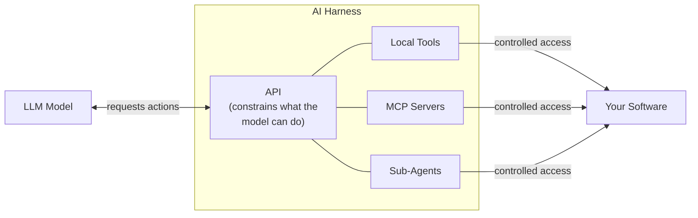

# AI Design Harness

A minimal, LLM-agnostic AI agent harness that orchestrates vectorial design workflows (CorelDraw-like) via tool calls. You describe a design project in natural language and the agent breaks it down into step-by-step tool invocations — creating documents, drawing shapes, inserting text, generating images, and more.

**Attention:** This project consists of 90% vibecoded content, so please review it before using for your own purposes. It is not production-ready and is intended as a proof of concept only.

## Purpose

This project is an experimental harness that demonstrates how an agentic loop can drive a creative design workflow. The LLM acts as an orchestrator: it interprets your instructions, decides which design operations to perform, and chains tool calls until the project is complete. The tools themselves are mock implementations that log actions to the console, making it easy to study the agent behavior without requiring an actual design application backend.

## What is an AI Harness?

> The harness consists of the tools and applications that enable and constrain an LLM's actions.



## In short

- The **LLM** never talks directly to your software.
- The **Harness** sits in between — it exposes an API that defines exactly what the model can and cannot do.
- Tools available to the model can be **Local Tools**, **MCP servers**, or **Sub-Agents**.
- Your software only receives actions that the harness allows.


## Architecture

```
User prompt
    │
    ▼
┌────────────────────┐
│    Agent Loop       │  ← reads user input, calls LLM, executes tools, repeats
├────────────────────┤
│  Prompt Builder    │  ← builds system prompt from registered tools
│  Response Parser   │  ← extracts tool invocations from LLM output
│  Tool Registry     │  ← holds all available design tools
│  LLM Executor     │  ← provider-agnostic LLM call abstraction
└────────────────────┘
```

Key design principles:
- **LLM-agnostic** — swap providers via CLI flags or env vars (Ollama, OpenAI, Kiro, or any OpenAI-compatible API).
- **Dependency Inversion** — the agent loop depends on interfaces, not concrete implementations.
- **Open/Closed** — new tools can be added without modifying existing code.

## Available Tools (30+)

| Category | Tools |
|----------|-------|
| Document & Pages | `create_document`, `create_page`, `duplicate_page`, `create_layer` |
| Drawing & Shapes | `insert_shape`, `draw_path`, `boolean_operation` |
| Text | `insert_text`, `text_on_path` |
| Images | `generate_image` (subagent), `import_image` |
| Appearance | `set_background`, `set_fill`, `set_stroke`, `set_opacity`, `set_blend_mode`, `apply_effect`, `create_color_palette` |
| Object Manipulation | `transform_object`, `resize_object`, `clone_object`, `delete_object`, `arrange_objects`, `group_objects`, `ungroup_objects`, `create_clipping_mask` |
| Symbols | `create_symbol`, `insert_symbol` |
| Layout | `add_guideline` |
| Export | `export_document` |

The `generate_image` tool operates as a **subagent** — it delegates prompt refinement to a separate LLM (optionally a different model) before simulating image generation.

## Setup

### Prerequisites

- Node.js >= 18 (`.nvmrc` specifies v24)
- An LLM backend: [Ollama](https://ollama.com) running locally, an OpenAI API key, or Kiro CLI installed

### Installation

```bash
git clone <repo-url>
cd AI-Design-harness
npm install
```

### Configuration

Copy the example environment file and fill in your values:

```bash
cp .env.example .env
```

Key environment variables:

| Variable | Description | Default |
|----------|-------------|---------|
| `AI_PROVIDER` | LLM provider (`ollama-cli`, `ollama-http`, `openai`, `kiro`) | `ollama-cli` |
| `AI_MODEL` | Model name (provider-specific) | `gemma4:e4b` |
| `AI_BASE_URL` | Base URL for HTTP providers | `http://localhost:11434/v1` |
| `AI_API_KEY` | API key (required for `openai`) | — |
| `OPENAI_API_KEY` | OpenAI-specific key | — |
| `OPENAI_MODEL` | OpenAI-specific model | `gpt-4.1-mini` |
| `AI_TEMPERATURE` | Generation temperature | `0.7` |
| `AI_MAX_TOKENS` | Max response tokens | `4096` |
| `DEBUG` | Enable verbose debug logging | `false` |

For the image generation subagent, set `IMAGE_SUBAGENT_PROVIDER`, `IMAGE_SUBAGENT_MODEL`, etc.

## Usage

### Development (with tsx, no build step)

```bash
# Default provider (ollama-cli)
npm run dev

# With debug logging
npm run dev:debug

# Specific providers
npm run dev:ollama
npm run dev:openai
npm run dev:kiro
```

### Production (compiled)

```bash
npm run build
npm start
```

### CLI Flags

You can override config at runtime:

```bash
tsx src/main.ts --provider=openai --model=gpt-4.1 --debug --think
```

| Flag | Description |
|------|-------------|
| `--provider=<name>` | LLM provider |
| `--model=<name>` | Model override |
| `--base-url=<url>` | API base URL |
| `--api-key=<key>` | API key |
| `--temperature=<n>` | Sampling temperature |
| `--max-tokens=<n>` | Max response tokens |
| `--debug` | Enable debug logging |
| `--think` | Enable thinking mode (ollama-cli) |

## Example Session

```
🎨 AI Design Harness
Provider: ollama-cli | Model: gemma4:e4b
Tools (31): create_document, create_page, ...

AI Design Harness ready. Describe your design project (Ctrl+C to exit).

You: Create a social media post for a coffee shop promotion, 1080x1080

  ⚙ create_document({"name":"Coffee Shop Promo","width":"1080","height":"1080","color_mode":"RGB"})
  [DESIGN] 📄 Created document "Coffee Shop Promo" (1080x1080px, RGB)
  ✓ create_document completed
  ⚙ create_layer({"name":"Background","document_id":"doc_..."})
  ...
```

## Project Structure

```
src/
├── main.ts               # Composition root — wires all dependencies
├── agent-loop.ts         # Core read-call-execute loop
├── interfaces.ts         # All interfaces (Tool, LLMExecutor, etc.)
├── prompt-builder.ts     # Builds the system prompt from tools
├── response-parser.ts    # Extracts tool invocations from LLM output
├── tool-registry.ts      # In-memory tool store
├── logger.ts             # Console / null logger
├── providers/            # LLM executor implementations
│   ├── kiro-cli.executor.ts
│   ├── ollama-cli.executor.ts
│   ├── openai-compatible.executor.ts
│   ├── openai.executor.ts
│   └── provider-factory.ts
├── subagents/            # Subagent tools (separate LLM delegation)
│   └── generate-image.agent.ts
└── tools/                # Design tool implementations (mock)
    ├── create-document.tool.ts
    ├── insert-shape.tool.ts
    ├── insert-text.tool.ts
    └── ... (30+ tools)
```

## License

Private / Unlicensed.
